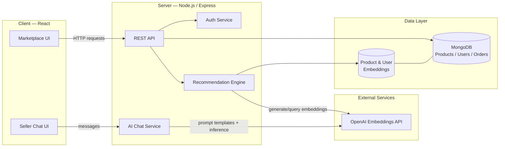
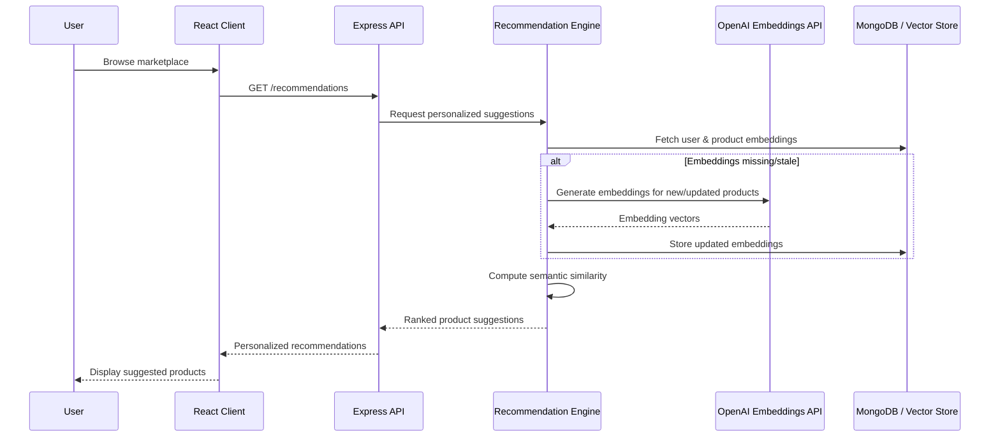

# SkillForge — MERN Artisan Marketplace

A full-stack MERN marketplace for artisans, with an embeddings-based recommendation engine that surfaces relevant products from semantic product and user data — powering personalized, real-time suggestions instead of basic keyword search.

## Overview

SkillForge connects independent artisans with buyers. Beyond standard e-commerce functionality (listings, carts, orders), it integrates OpenAI embeddings to power semantic product recommendations and AI-assisted, seller-facing chat features for improving product discoverability across the marketplace.

## Features

- 🛍️ **Product listings & marketplace** — sellers list artisan products, buyers browse and purchase
- 🧠 **Embeddings-based recommendations** — semantic similarity search over product & user data (OpenAI Embeddings) instead of simple category/tag matching
- 💬 **AI-assisted seller chat** — inference APIs and optimized prompt templates to help sellers respond to buyer queries and improve discoverability
- 🔐 **REST API backend** — Express + MongoDB powering auth, products, orders, and recommendations
- ⚛️ **React frontend** — browsing, cart, and checkout experience
- 🔄 **Real-time personalized suggestions** — recommendations update as user/product data changes

## Tech Stack

| Layer | Technology |
|---|---|
| Frontend | React, TypeScript |
| Backend | Node.js, Express |
| Database | MongoDB |
| AI / Recommendations | OpenAI Embeddings, semantic similarity search |
| API | REST |

## Architecture



## Recommendation Pipeline



## Project Structure

```
Softronix_E-commerce/
├── client/          # React + TypeScript frontend
├── server/          # Node.js + Express API
├── futurecomps/      # Planned/upcoming components
├── .gitignore
└── README.md
```

> Structure above reflects the general MERN layout of the project — see the repo for exact folder contents.

## Getting Started

### Prerequisites

- Node.js (v18+)
- MongoDB instance (local or Atlas)
- OpenAI API key

### Installation

```bash
git clone https://github.com/faizankhan828/Softronix_E-commerce.git
cd Softronix_E-commerce
```

**Backend**
```bash
cd server
npm install
# add a .env file with MONGO_URI, OPENAI_API_KEY, etc.
npm run dev
```

**Frontend**
```bash
cd client
npm install
npm run dev
```

## Roadmap

- Expand embeddings pipeline to cover more product metadata
- Order tracking and seller analytics dashboard
- Payment gateway integration
- Improved seller chat with richer prompt context

## Author

**Faizan Khan**
AI-Focused Full-Stack Developer | Python, Django & MERN Stack
- GitHub: [@faizankhan828](https://github.com/faizankhan828)
- LinkedIn: [Faizan Khan](https://www.linkedin.com/in/faizan-khan-a40566263/)
- Portfolio: [faizankhan-zeta.vercel.app](https://faizankhan-zeta.vercel.app/)
